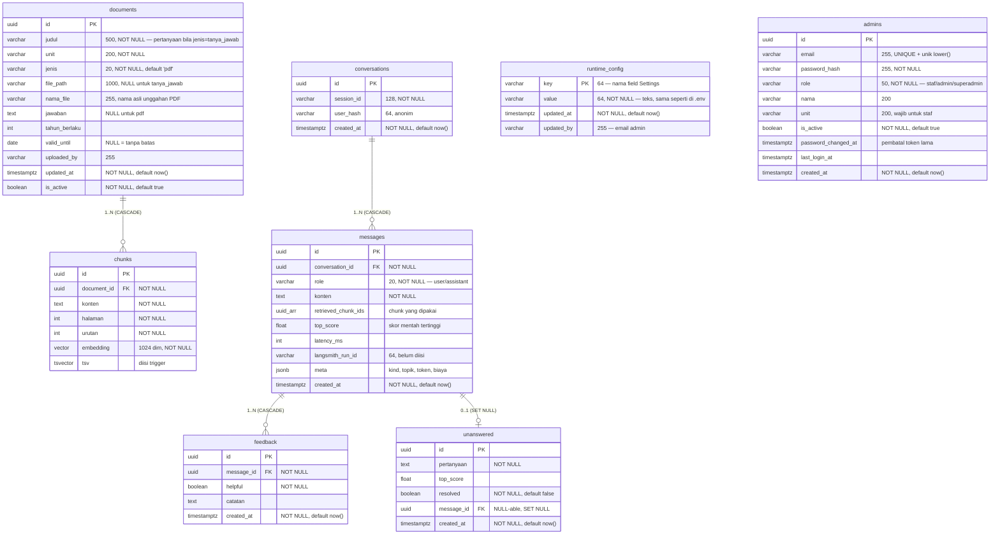

# Skema Database

PostgreSQL 16 + [pgvector](https://github.com/pgvector/pgvector). **Satu** database
menampung metadata dokumen, vektor, indeks full-text, log percakapan, dan akun
dashboard — tidak ada Elasticsearch, tidak ada vector store terpisah (PRD §10).

Sumber kebenaran skema ada di dua tempat yang harus selalu sepadan:

| Berkas | Peran |
|---|---|
| `app/db/models.py` | Model SQLAlchemy 2.0 — dipakai kode dan `alembic check` |
| `alembic/versions/*.py` | Riwayat migrasi — yang benar-benar dijalankan di server |

Perubahan skema wajib menyentuh keduanya. `alembic check` akan gagal bila model
dan database berbeda.

---

## ERD



`runtime_config` juga berdiri sendiri: satu baris per parameter `.env` yang
ditimpa dari dashboard, dan **hanya** parameter yang benar-benar ditimpa. Tidak
ada barisnya berarti "ikut `.env`" -- lihat `app/admin/runtime_config.py`.

`admins` sengaja berdiri sendiri tanpa relasi. Jejak admin pada dokumen disimpan
sebagai teks di `documents.uploaded_by`, bukan foreign key: menghapus akun tidak
boleh menghapus atau membuat NULL riwayat dokumen yang pernah diunggahnya.

### Tiga kelompok tabel

| Kelompok | Tabel | Ditulis oleh | Dibaca oleh |
|---|---|---|---|
| **Pengetahuan** | `documents`, `chunks` | `app/ingestion/`, `app/admin/faq.py` | retrieval FR-2 |
| **Log** | `conversations`, `messages`, `feedback`, `unanswered` | `app/observability/chatlog.py`, `app/routers/chat.py` | dashboard AD-4, AD-5 |
| **Akun** | `admins` | `app/admin/accounts.py`, `scripts/create_admin.py` | auth AD-1 |
| **Setelan** | `runtime_config` | `app/routers/admin_config.py` | `get_effective_settings` di setiap permintaan |

---

## `documents` — satu tabel, dua jenis isi

Baris `documents` adalah **sumber kebenaran yang dapat disunting**; `chunks`
hanyalah turunannya. Kolom `jenis` menentukan dari mana isinya berasal:

| `jenis` | Asal isi | `file_path` | `nama_file` | `jawaban` | `judul` |
|---|---|---|---|---|---|
| `pdf` | Berkas resmi yang diunggah admin | kunci objek, **NOT NULL** | nama asli unggahan | **NULL** | judul dokumen |
| `tanya_jawab` | Diketik admin di dashboard | **NULL** | **NULL** | isi jawaban, **NOT NULL** | pertanyaannya |

Keduanya berbagi satu tabel supaya seluruh mesin yang sudah ada berlaku tanpa
perubahan: filter dokumen aktif, masa berlaku, unit, chunking, embedding, dan
sitasi. Retrieval tidak perlu tahu bedanya.

Aturan itu ditegakkan database, bukan hanya kode:

```sql
CONSTRAINT ck_documents_jenis CHECK (jenis IN ('pdf', 'tanya_jawab'))

CONSTRAINT ck_documents_isi_sesuai_jenis CHECK (
     (jenis = 'pdf'         AND file_path IS NOT NULL AND jawaban IS NULL)
  OR (jenis = 'tanya_jawab' AND file_path IS NULL     AND jawaban IS NOT NULL)
)
```

Alasannya konkret: PDF tanpa berkas membuat kartu sitasi FE-2 menunjuk ke
ketiadaan — dan itu terlihat mahasiswa; entri tanya jawab tanpa jawaban tidak
dapat disunting kembali.

**`file_path` menyimpan kunci objek** (`documents/<uuid>.pdf`), bukan lintasan
disk. Berpindah dari disk lokal ke S3/R2 karena itu tidak memaksa migrasi data.
**`nama_file` menyimpan nama asli unggahan** untuk `Content-Disposition` saat
PDF dibuka atau diunduh. Nama ini tidak dipakai sebagai kunci objek, sehingga
nama yang sama dari dua unggahan tidak saling menimpa.

### Dua predikat turunan `documents`

Keduanya punya satu definisi saja di kode, dan sengaja saling berlawanan:

| Predikat | Modul | Arti |
|---|---|---|
| `active_document_clause()` | `app/rag/filters.py` | `is_active AND (valid_until IS NULL OR valid_until > now())` — **wajib** ada di setiap query retrieval |
| `stale_clause()` | `app/admin/documents.py` | `updated_at < now() - interval '6 months' OR valid_until <= now()` — badge "perlu ditinjau" (AD-2) |

Batas `valid_until` di keduanya persis berlawanan, sehingga dokumen yang diberi
badge kedaluwarsa di dashboard tepat dokumen yang sudah berhenti terambil
retrieval. Penyaringan terjadi di dalam `WHERE` SQL, bukan setelah hasil kembali
— dokumen kedaluwarsa tidak boleh pernah ikut terambil lalu disaring belakangan.

---

## `chunks` — vektor dan full-text di baris yang sama

Satu baris = satu potongan teks siap di-embed. Ditulis lewat SQL langsung
(`app/ingestion/embedder.py`), bukan `vectorstore.add_documents()`, karena kolom
metadata kustom dan pembuatan `tsvector` tidak terjangkau abstraksi VectorStore.

| Kolom | Catatan |
|---|---|
| `embedding vector(1024)` | Dimensinya **harus** sama dengan keluaran `EMBED_MODEL` |
| `tsv tsvector` | Diisi trigger, bukan kode aplikasi |
| `halaman` | Selalu `1` untuk entri tanya jawab — sitasi berformat `[Judul, hal. N]` |
| `urutan` | Urutan chunk dalam dokumen, dipakai untuk merangkai konteks |

`EMBEDDING_DIM = 1024` muncul di `app/db/models.py` dan `alembic/versions/0001`.
**Mengganti `EMBED_MODEL` ke model berdimensi lain bukan sekadar migrasi kolom** —
seluruh dokumen harus di-index ulang. `embed_and_store` memeriksa dimensi
sebelum `INSERT` supaya galatnya menyebut `EMBED_MODEL`, bukan `DBAPIError`
generik dari pgvector.

### Trigger `tsv`

```sql
CREATE FUNCTION chunks_tsv_update() RETURNS trigger AS $$
BEGIN
    NEW.tsv := to_tsvector('indonesian', COALESCE(NEW.konten, ''));
    RETURN NEW;
END
$$ LANGUAGE plpgsql;

CREATE TRIGGER trg_chunks_tsv
    BEFORE INSERT OR UPDATE OF konten ON chunks
    FOR EACH ROW EXECUTE FUNCTION chunks_tsv_update();
```

Diisi otomatis supaya tidak ada jalur penulisan yang bisa lupa mengisinya dan
diam-diam mematikan separuh retrieval hibrida.

> **Prasyarat rilis:** konfigurasi FTS `indonesian` harus tersedia di instans
> target. Periksa dengan `SELECT cfgname FROM pg_ts_config;`. Bila tidak ada,
> seluruh jalur FTS gagal diam-diam. Test integrasi memeriksa ini.

---

## Indeks

| Indeks | Tabel | Definisi | Untuk |
|---|---|---|---|
| `ix_documents_aktif` | `documents` | `(is_active, valid_until)` | filter dokumen aktif FR-2 |
| `ix_chunks_document_id` | `chunks` | `(document_id)` | JOIN retrieval, hitung chunk per dokumen |
| `ix_chunks_tsv` | `chunks` | **GIN** `(tsv)` | full-text search |
| `ix_chunks_embedding_hnsw` | `chunks` | **HNSW** `(embedding vector_cosine_ops)` | vector search |
| `ix_conversations_session_id` | `conversations` | `(session_id)` | mencari percakapan aktif satu sesi |
| `ix_messages_conversation_id` | `messages` | `(conversation_id)` | merangkai riwayat |
| `ix_messages_created_at` | `messages` | `(created_at)` | rentang tanggal AD-5 |
| `ix_feedback_message_id` | `feedback` | `(message_id)` | agregasi kepuasan, JOIN daftar umpan balik |
| `ix_unanswered_created_at` | `unanswered` | `(created_at)` | filter `sejak` AD-4 |
| `ix_admins_email_lower` | `admins` | **UNIQUE** `(lower(email))` | login tidak peka huruf besar |

Dua indeks yang mudah rusak tanpa terasa:

**HNSW — operator class harus cocok.** `vector_cosine_ops` sepadan dengan
operator `<=>` yang dipakai `app/rag/retriever.py`. Indeks dengan operator class
lain akan diabaikan optimizer **secara diam-diam**: hasil pencarian tetap benar,
tetapi berubah menjadi sequential scan. Indeks ini dibuat lewat SQL mentah di
migrasi, **dan** tetap dideklarasikan di `models.py` — tanpa deklarasi itu,
`alembic revision --autogenerate` akan menganggapnya indeks liar dan menghasilkan
`DROP INDEX`.

**`ix_admins_email_lower`.** Login dan pencarian akun memakai `lower(email)`.
Tanpa indeks unik ini, `Admin@kampus.ac.id` dan `admin@kampus.ac.id` bisa menjadi
dua akun berbeda.

---

## Perilaku penghapusan

| Relasi | Aksi | Alasan |
|---|---|---|
| `chunks.document_id` → `documents.id` | `CASCADE` | Chunk yatim tetap terambil retrieval tanpa induk dokumen yang sah |
| `messages.conversation_id` → `conversations.id` | `CASCADE` | Pesan tanpa percakapan tidak punya arti |
| `feedback.message_id` → `messages.id` | `CASCADE` | Umpan balik tanpa pesan tidak dapat ditafsirkan |
| `unanswered.message_id` → `messages.id` | **`SET NULL`** | Log percakapan boleh dibersihkan, sinyal perbaikan AD-4 tidak ikut hilang |

`unanswered` sengaja berbeda. Ia bukan turunan log, melainkan daftar pekerjaan
admin — retensi log tidak boleh mengosongkannya.

---

## `messages.meta` (JSONB)

Ditulis `app/observability/chatlog.py::build_meta`, dibaca `app/admin/stats.py`.
Hanya diisi pada baris `role = 'assistant'`.

| Kunci | Tipe | Isi |
|---|---|---|
| `kind` | string | `answer` \| `refusal` \| `support` \| `smalltalk` |
| `escalated` | bool | Jawaban menyertakan kontak unit (FR-6) |
| `topik` | array | Topik berisiko tinggi yang terdeteksi |
| `sensitivitas` | string \| null | Tingkat sensitif (FR-7) |
| `llm_dipanggil` | bool | Penolakan FR-3 dan FR-7 bernilai `false` |
| `model` | string \| null | Hanya diisi bila LLM benar-benar dipanggil |
| `input_tokens` / `output_tokens` | int \| null | Dari `usage_metadata` LangChain |
| `biaya_usd` | float \| null | `null` bila tarif modelnya tidak dikenal |
| `rewritten_query` | string \| null | Hasil penulisan ulang query (FR-4) |

Struktur ini bukan sekadar catatan — statistik AD-5 memfilter langsung atasnya
(`m.meta->>'kind'`, `m.meta->'topik'`). Menambah nilai `kind` baru tanpa
menyesuaikan `app/admin/stats.py` membuat pesan itu hilang dari semua hitungan.

**`biaya_usd = null` ≠ biaya nol.** Jawaban dari model yang tarifnya belum ada di
`app/observability/costs.py` dilaporkan terpisah sebagai
`pesan_tanpa_estimasi_biaya`, bukan dianggap gratis.

---

## Yang tidak disimpan, dan mengapa

Ini bagian skema yang paling mudah dilanggar tanpa sadar (PRD §11):

- **Identitas mahasiswa.** `conversations.user_hash` adalah hash anonim dan tidak
  boleh dapat dikembalikan ke identitas. `session_id` berasal dari localStorage
  peramban, bukan dari NIM.
- **Isi pertanyaan sensitif (FR-7).** `messages.konten` untuk pertanyaan sensitif
  diganti penanda tetap: `[disembunyikan: pertanyaan sensitif, dialihkan ke
  layanan konseling]`. Jumlahnya tetap tercatat untuk statistik, tetapi curahan
  hati mahasiswa tidak ikut terbaca siapa pun yang membuka database.
- **Uji coba admin (AD-6)** tidak dicatat sama sekali.
- **Kill switch dan pembatas login** tinggal di memori proses, bukan tabel. Benar
  untuk satu worker uvicorn (sesuai Dockerfile); harus dipindah ke Postgres bila
  jumlah worker ditambah.

---

## Pola penulisan yang perlu dipertahankan

**Ingestion satu transaksi.** Dokumen + seluruh chunk-nya masuk dalam satu
transaksi (`app/ingestion/pipeline.py`). Dokumen yang gagal di tengah jalan tidak
boleh meninggalkan indeks setengah terisi.

**Berkas diunggah sebelum baris DB ditulis.** Penyimpanan objek berada di luar
transaksi database, jadi salah satunya pasti bisa gagal sendirian. Urutannya
dipilih agar kegagalan menghasilkan objek yatim (hanya memakan tempat), bukan
baris yatim (kartu sitasi menunjuk ke ketiadaan — terlihat mahasiswa). Bila
transaksi DB gagal, objeknya dihapus lagi.

**Suntingan tanya jawab memicu re-index.** Mengubah `judul` atau `jawaban` pada
entri `tanya_jawab` membuang chunk lama dan menghitung ulang embedding. Indeks
yang masih memuat kalimat versi lama akan menjawab mahasiswa dengan aturan yang
sudah dicabut.

**`updated_at` hanya bergerak untuk perubahan isi.** `is_active` tidak termasuk:
menyalakan ulang dokumen lama tidak boleh menghapus badge "perlu ditinjau"-nya.

**Log gagal ditulis tidak menggagalkan jawaban.** `ChatLogger.log` menelan
galatnya dan mengembalikan `None`. Database yang tersendat sesaat lebih baik
kehilangan satu baris log daripada membuat mahasiswa melihat galat setelah
jawabannya sudah jadi.

**`clock_timestamp()`, bukan `now()`, untuk `messages`.** `now()` bernilai sama
sepanjang transaksi, sehingga pertanyaan dan jawabannya akan bercap waktu
identik dan urutannya tak tentu.

**Percakapan dipotong oleh jeda 30 menit.** `session_id` tinggal di localStorage
berbulan-bulan; tanpa batas jeda (`CONVERSATION_IDLE_MINUTES`), seluruh pemakaian
satu peramban terhitung sebagai satu percakapan.

**Statistik dikelompokkan menurut `TIMEZONE`, bukan UTC.** Default
`Asia/Jakarta` — supaya pertanyaan pukul 06.00 WIB tidak tercatat sebagai
pertanyaan hari sebelumnya.

---

## Riwayat migrasi

| Revisi | Isi |
|---|---|
| `0001_skema_awal` | Extension `vector`, tujuh tabel, indeks HNSW + GIN, trigger `tsv` |
| `0002_selaraskan_not_null` | Tujuh kolom NOT NULL yang tertinggal — termasuk `chunks.embedding` |
| `0003_log_dashboard_admin` | `unanswered.message_id`, indeks `created_at` untuk AD-4/AD-5 |
| `0004_level_akses_admin` | `nama`, `unit`, `is_active`, `password_changed_at`, `last_login_at`; `editor` → `admin`; unik `lower(email)` |
| `0005_entri_tanya_jawab` | `jenis`, `jawaban`; `file_path` menjadi nullable; dua CHECK constraint |
| `0006_nama_file_asli` | `nama_file` untuk nama tab browser dan nama unduhan PDF |

Catatan per migrasi:

- **0002** aman hanya selama tabel belum berisi NULL pada kolom tersebut.
  `chunks.embedding` NULL membuat chunk tidak pernah terambil vector search —
  dokumen tampak terindeks padahal separuh retrieval tidak melihatnya.
- **0005 downgrade menghapus data.** Baris `tanya_jawab` tidak punya berkas, jadi
  tidak ada cara mengubahnya menjadi dokumen PDF yang sah — baris beserta
  chunk-nya dihapus.

```bash
alembic upgrade head          # terapkan
alembic check                 # model vs database harus sepadan
alembic revision --autogenerate -m "..."
alembic downgrade -1
```

## Koneksi

```
postgresql+asyncpg://<user>:<pass>@<host>:5432/<db>
```

Driver **asyncpg** (`app/db/session.py`), pool default 10 (`DB_POOL_SIZE`),
`pool_pre_ping=True`.

Dua konsekuensi asyncpg yang menyentuh skema:

**Tipe `vector` tidak punya codec asyncpg.** Embedding dikirim sebagai literal
teks yang di-cast `::vector` di SQL — mengirim list Python langsung gagal dengan
`expected str, got list`. Formatnya dibentuk satu fungsi saja,
`retriever.vector_literal`, dan dipakai baik saat menulis maupun saat mencari;
dua format berbeda adalah sumber bug yang sulit dilacak.

**Satu koneksi menolak dua query bersamaan** (`another operation is in
progress`). Karena itu `PostgresHybridRetriever` membuka sesi terpisah untuk
pencarian vektor dan full-text — paralelisme FR-2 hanya mungkin dengan dua
koneksi.

Akses langsung ke database produksi lewat SSH tunnel: lihat `docs/start.md`.
