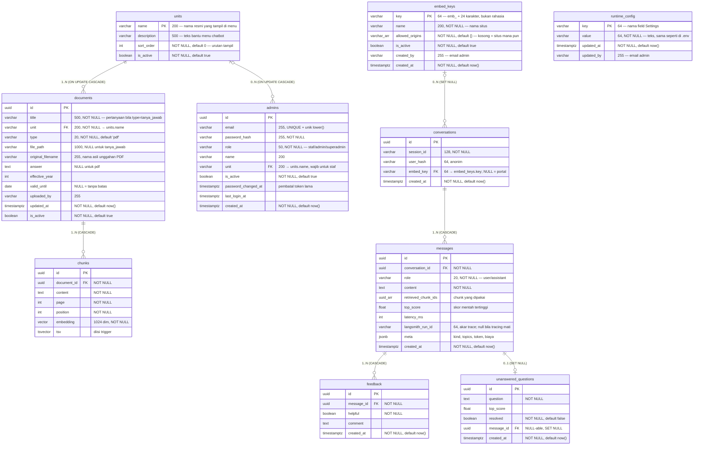

# Skema Database

PostgreSQL 16 + [pgvector](https://github.com/pgvector/pgvector). **Satu** database
menampung metadata dokumen, vektor, indeks full-text, log percakapan, dan akun
dashboard — tidak ada Elasticsearch, tidak ada vector store terpisah (PRD §10).

Sumber kebenaran skema ada di dua tempat yang harus selalu sepadan:

| Berkas | Peran |
|---|---|
| `app/db/models.py` | Model SQLAlchemy 2.0 — dipakai kode dan `alembic check` |
| `alembic/versions/*.py` | Riwayat migrasi — yang benar-benar dijalankan di server |

Perubahan skema wajib menyentuh keduanya. `alembic check` akan gagal bila model
dan database berbeda.

---

## ERD


```mermaid
erDiagram
    documents ||--o{ chunks : "1..N (CASCADE)"
    conversations ||--o{ messages : "1..N (CASCADE)"
    messages ||--o{ feedback : "1..N (CASCADE)"
    messages ||--o| unanswered_questions : "0..1 (SET NULL)"
    units ||--o{ documents : "1..N (ON UPDATE CASCADE)"
    units |o--o{ admins : "0..N (ON UPDATE CASCADE)"
    embed_keys |o--o{ conversations : "0..N (SET NULL)"

    units {
        varchar  name PK "200 — nama resmi yang tampil di menu"
        varchar  description "500 — teks bantu menu chatbot"
        int      sort_order "NOT NULL, default 0 — urutan tampil"
        boolean  is_active "NOT NULL, default true"
    }

    documents {
        uuid     id PK
        varchar  title "500, NOT NULL — pertanyaan bila type=tanya_jawab"
        varchar  unit FK "200, NOT NULL → units.name"
        varchar  type "20, NOT NULL, default 'pdf'"
        varchar  file_path "1000, NULL untuk tanya_jawab"
        varchar  original_filename "255, nama asli unggahan PDF"
        text     answer "NULL untuk pdf"
        int      effective_year
        date     valid_until "NULL = tanpa batas"
        varchar  uploaded_by "255"
        timestamptz updated_at "NOT NULL, default now()"
        boolean  is_active "NOT NULL, default true"
    }

    chunks {
        uuid     id PK
        uuid     document_id FK "NOT NULL"
        text     content "NOT NULL"
        int      page "NOT NULL"
        int      position "NOT NULL"
        vector   embedding "1024 dim, NOT NULL"
        tsvector tsv "diisi trigger"
    }

    conversations {
        uuid     id PK
        varchar  session_id "128, NOT NULL"
        varchar  user_hash "64, anonim"
        varchar  embed_key FK "64 → embed_keys.key; NULL = portal"
        timestamptz created_at "NOT NULL, default now()"
    }

    embed_keys {
        varchar  key PK "64 — emb_ + 24 karakter, bukan rahasia"
        varchar  name "200, NOT NULL — nama situs"
        varchar_arr allowed_origins "NOT NULL, default {} — kosong = situs mana pun"
        boolean  is_active "NOT NULL, default true"
        varchar  created_by "255 — email admin"
        timestamptz created_at "NOT NULL, default now()"
    }

    messages {
        uuid     id PK
        uuid     conversation_id FK "NOT NULL"
        varchar  role "20, NOT NULL — user/assistant"
        text     content "NOT NULL"
        uuid_arr retrieved_chunk_ids "chunk yang dipakai"
        float    top_score "skor mentah tertinggi"
        int      latency_ms
        varchar  langsmith_run_id "64, akar trace; null bila tracing mati"
        jsonb    meta "kind, topics, token, biaya"
        timestamptz created_at "NOT NULL, default now()"
    }

    feedback {
        uuid     id PK
        uuid     message_id FK "NOT NULL"
        boolean  helpful "NOT NULL"
        text     comment
        timestamptz created_at "NOT NULL, default now()"
    }

    unanswered_questions {
        uuid     id PK
        text     question "NOT NULL"
        float    top_score
        boolean  resolved "NOT NULL, default false"
        uuid     message_id FK "NULL-able, SET NULL"
        timestamptz created_at "NOT NULL, default now()"
    }

    runtime_config {
        varchar  key PK "64 — nama field Settings"
        varchar  value "64, NOT NULL — teks, sama seperti di .env"
        timestamptz updated_at "NOT NULL, default now()"
        varchar  updated_by "255 — email admin"
    }

    admins {
        uuid     id PK
        varchar  email "255, UNIQUE + unik lower()"
        varchar  password_hash "255, NOT NULL"
        varchar  role "50, NOT NULL — staf/admin/superadmin"
        varchar  name "200"
        varchar  unit FK "200 → units.name, wajib untuk staf"
        boolean  is_active "NOT NULL, default true"
        timestamptz password_changed_at "pembatal token lama"
        timestamptz last_login_at
        timestamptz created_at "NOT NULL, default now()"
    }
```

`runtime_config` berdiri sendiri tanpa relasi: satu baris per parameter `.env` yang
ditimpa dari dashboard, dan **hanya** parameter yang benar-benar ditimpa. Tidak
ada barisnya berarti "ikut `.env`" -- lihat `app/admin/runtime_config.py`.

`admins` hanya berelasi ke `units`. Jejak admin pada dokumen disimpan sebagai
teks di `documents.uploaded_by`, bukan foreign key: menghapus akun tidak boleh
menghapus atau membuat NULL riwayat dokumen yang pernah diunggahnya.

Dua CHECK constraint di `admins` menegakkan level akses di database:

```sql
CONSTRAINT ck_admins_role       CHECK (role IN ('staf', 'admin', 'superadmin'))
CONSTRAINT ck_admins_staff_unit CHECK (role <> 'staf' OR (unit IS NOT NULL AND btrim(unit) <> ''))
```

### Kelompok tabel

| Kelompok | Tabel | Ditulis oleh | Dibaca oleh |
|---|---|---|---|
| **Pengetahuan** | `documents`, `chunks` | `app/ingestion/`, `app/admin/faq.py` | retrieval FR-2 |
| **Referensi** | `units` | migrasi `0009` (isi awal), `app/routers/admin_units.py` (halaman Unit, superadmin) | `app/units.py`: menu chatbot, validasi setiap isian unit, filter retrieval |
| **Log** | `conversations`, `messages`, `feedback`, `unanswered_questions` | `app/observability/chatlog.py`, `app/routers/chat.py` | dashboard AD-4, AD-5 |
| **Akun** | `admins` | `app/admin/accounts.py`, `scripts/create_admin.py` | auth AD-1 |
| **Setelan** | `runtime_config` | `app/routers/admin_config.py` | `get_effective_settings` di setiap permintaan |
| **Sematan** | `embed_keys` | `app/routers/admin_embed_keys.py` (halaman Sematan, superadmin) | `GET /api/embed/keys/{key}` (proxy portal), `deps.kunci_sematan` di setiap pertanyaan dari situs lain |

Biaya model tidak punya tabel sendiri: seluruhnya menumpang `messages.meta`
(lihat [`messages.meta`](#messagesmeta-jsonb) dan
[Biaya embedding ingestion](#biaya-embedding-ingestion-tidak-dicatat)).

---

## Konvensi penamaan

Berlaku untuk setiap identifier yang tersimpan atau lewat jaringan: tabel, kolom,
constraint, index, trigger, kunci JSONB (`messages.meta`), tabel dan kolom log
SQLite (`docs/logs.md`), serta field, query param, path param, dan nama schema
di `api.yaml`.

**Identifier berbahasa Inggris; nilai dan teks tetap bahasa Indonesia.**

| Jenis | Bahasa | Contoh |
|---|---|---|
| Identifier | Inggris | `documents.title`, `meta->>'llm_cost_usd'`, `?since=` |
| Nilai data dan kode enum | apa adanya | `type = 'tanya_jawab'`, `role = 'staf'`, `embed_cost_source = 'estimasi'`, unit `Keuangan` |
| Teks untuk manusia | Indonesia | label UI, pesan galat `detail`, prompt, komentar, dokumen ini |

Aturannya dibuat per lapisan, bukan per kolom. Kolom seperti `id`, `created_at`,
`is_active`, dan `*_id` sudah pasti berbahasa Inggris karena konvensi framework.
Aturan "kolom teknis Inggris, kolom domain Indonesia" menuntut penilaian untuk
setiap kolom baru. Aturan itu pula yang dulu menghasilkan `dibuat_oleh`
berdampingan dengan `updated_by` untuk konsep yang sama.

### Pola nama

| Unsur | Pola | Contoh |
|---|---|---|
| Tabel | snake_case, kata benda jamak; kata benda tak terhitung dan tabel setelan tunggal tetap tunggal | `documents`, `embed_keys`, `unanswered_questions`; `feedback`, `runtime_config` |
| Kolom | snake_case | `title`, `allowed_origins` |
| Primary key | `id` (UUID), kecuali kunci alami yang memang tampil ke pengguna | `units.name`, `embed_keys.key`, `runtime_config.key` |
| Foreign key | `<tabel tunggal>_id` bila merujuk `id`; nama konsepnya bila merujuk kunci alami | `document_id`; `documents.unit` → `units.name` |
| Boolean | dibaca sebagai pernyataan ya/tidak | `is_active`, `helpful`, `resolved`, `llm_called` |
| Waktu | `<peristiwa>_at` (timestamptz); `valid_until` untuk batas tanggal | `created_at`, `last_login_at` |
| Pelaku | `<peristiwa>_by`, berisi email admin sebagai teks, bukan FK | `created_by`, `updated_by`, `uploaded_by` |
| Urutan | `sort_order` untuk urutan tampil yang diatur admin; `position` untuk urutan di dalam induknya | `units.sort_order`, `chunks.position` |
| Jumlah, rasio | `<benda>_count`, `<benda>_ratio` | `chunk_count`, `error_ratio` |
| Biaya, durasi | `<sumber>_cost_usd`, `<benda>_ms` | `llm_cost_usd`, `embed_cost_usd`, `latency_ms` |
| Index | `ix_<tabel>_<kolom atau tujuan>` | `ix_documents_unit`, `ix_documents_active` |
| CHECK | `ck_<tabel>_<aturan>` | `ck_documents_content_matches_type` |
| Trigger | `trg_<tabel>_<kolom>` | `trg_chunks_tsv` |

Kunci JSONB mengikuti pola kolom. Field API yang mencerminkan kolom memakai
nama kolomnya. Pengecualiannya bila artinya berbeda bagi konsumen API: entri
tanya jawab mengirim `question`/`answer`, yang tersimpan di
`documents.title`/`documents.answer`.

**Yang sengaja tidak mengikuti aturan ini:**

- Nama berkas dan revisi migrasi (`0013_identifier_bahasa_inggris`). Keduanya
  label riwayat, dan revisi lama tidak dapat diganti tanpa merusak
  `alembic_version`.
- Nama internal Python: fungsi, variabel, dan field dataclass yang tidak lewat
  jaringan. Kalau lapisan ini juga mau diseragamkan, kerjakan sebagai langkah
  terpisah. Pengecualiannya record yang dibangun langsung dari baris tabel
  (`UnitRecord`, `KunciSematan`, `Account`). Field-nya sekaligus menjadi daftar
  kolom SQL dan kunci perubahan dari API, jadi namanya mengikuti kolom.
- Kunci yang ditentukan layanan luar, misalnya isi permintaan ke gerbang JEV
  (`app/rag/gate.py`). Kontraknya milik layanan itu, jadi tidak dapat diganti
  dari sisi kita.

---

## `documents` — satu tabel, dua jenis isi

Baris `documents` adalah **sumber kebenaran yang dapat disunting**; `chunks`
hanyalah turunannya. Kolom `type` menentukan dari mana isinya berasal:

| `type` | Asal isi | `file_path` | `original_filename` | `answer` | `title` |
|---|---|---|---|---|---|
| `pdf` | Berkas resmi yang diunggah admin | kunci objek, **NOT NULL** | nama asli unggahan | **NULL** | judul dokumen |
| `tanya_jawab` | Diketik admin di dashboard | **NULL** | **NULL** | isi jawaban, **NOT NULL** | pertanyaannya |

Keduanya berbagi satu tabel supaya seluruh mesin yang sudah ada berlaku tanpa
perubahan: filter dokumen aktif, masa berlaku, unit, chunking, embedding, dan
sitasi. Retrieval tidak perlu tahu bedanya.

Aturan itu ditegakkan database, bukan hanya kode:

```sql
CONSTRAINT ck_documents_type CHECK (type IN ('pdf', 'tanya_jawab'))

CONSTRAINT ck_documents_content_matches_type CHECK (
     (type = 'pdf'         AND file_path IS NOT NULL AND answer IS NULL)
  OR (type = 'tanya_jawab' AND file_path IS NULL     AND answer IS NOT NULL)
)
```

Alasannya konkret: PDF tanpa berkas membuat kartu sitasi FE-2 menunjuk ke
ketiadaan — dan itu terlihat mahasiswa; entri tanya jawab tanpa jawaban tidak
dapat disunting kembali.

**`file_path` menyimpan kunci objek** (`documents/<uuid>.pdf`), bukan lintasan
disk. Berpindah dari disk lokal ke S3/R2 karena itu tidak memaksa migrasi data.
**`original_filename` menyimpan nama asli unggahan** untuk `Content-Disposition` saat
PDF dibuka atau diunduh. Nama ini tidak dipakai sebagai kunci objek, sehingga
nama yang sama dari dua unggahan tidak saling menimpa.

### Dua predikat turunan `documents`

Keduanya punya satu definisi saja di kode, dan sengaja saling berlawanan:

| Predikat | Modul | Arti |
|---|---|---|
| `active_document_clause()` | `app/rag/filters.py` | `is_active AND (valid_until IS NULL OR valid_until > now())` — **wajib** ada di setiap query retrieval |
| `stale_clause()` | `app/admin/documents.py` | `updated_at < now() - interval '6 months' OR valid_until <= now()` — badge "perlu ditinjau" (AD-2) |

Batas `valid_until` di keduanya persis berlawanan, sehingga dokumen yang diberi
badge kedaluwarsa di dashboard tepat dokumen yang sudah berhenti terambil
retrieval. Penyaringan terjadi di dalam `WHERE` SQL, bukan setelah hasil kembali
— dokumen kedaluwarsa tidak boleh pernah ikut terambil lalu disaring belakangan.

---

## `units` — daftar tetap unit layanan

Mahasiswa memilih unit di menu chatbot, lalu retrieval hanya mencari di dokumen
unit itu. Filter tersebut hanya dapat dipercaya bila setiap dokumen memakai nama
yang **persis** sama — selama `documents.unit` diketik bebas, dokumen berlabel
"Bagian Keuangan" tidak pernah terambil untuk pilihan "Keuangan", dan mahasiswa
menerima penolakan padahal jawabannya ada. Karena itu `documents.unit` dan
`admins.unit` kini foreign key ke `units.name`.

**Nama sebagai kunci utama, bukan kode terpisah.** Nilai yang tersimpan di
`documents.unit` tetap nama yang tampil di dashboard, sehingga kontrak API admin
tidak berubah. `ON UPDATE CASCADE` membuat penggantian nama cukup satu `UPDATE`
di `units`; dokumen dan akun staf ikut.

**Dikelola dari dashboard.** Superadmin menambah, mengganti nama, mengatur
urutan, dan menonaktifkan unit lewat `/api/admin/units` (halaman Unit).
Nama yang hanya berbeda huruf besar atau spasi dari unit lain ditolak 409 —
`cocokkan` hanya akan pernah menemukan salah satunya.

**Unit tidak dihapus, tetapi dinonaktifkan.** `ON DELETE` memakai bawaan
`NO ACTION`: menghapus unit yang masih dipakai ditolak database. `is_active =
false` menyembunyikannya dari menu (`GET /api/units`) dan dari pilihan untuk
dokumen baru; dokumen lamanya tetap ada.

**Normalisasi di pintu masuk, perbandingan persis di retrieval.** Setiap isian
unit (unggah dokumen, entri tanya jawab, akun, chat, uji coba) melewati
`deps.unit_terdaftar` → `app/units.py::cocokkan`, yang mencocokkan lewat
`permissions.normalize_unit` dan mengembalikan ejaan resmi — `" keuangan "`
menjadi `Keuangan`, nama tak dikenal ditolak 422. Filter retrieval sendiri
membandingkan persis:

```sql
(CAST(:unit AS text) IS NULL OR d.unit = CAST(:unit AS text))   -- NULL = semua unit
```

Satu SQL untuk kedua kasus, bukan dua varian query yang bisa menyimpang. `CAST`
wajib: asyncpg tidak dapat menebak tipe parameter yang hanya muncul di `IS NULL`.

**Memecah `chunks` per unit sempat dipertimbangkan dan ditolak.** Pertanyaan
lintas unit (cuti akademik menyangkut BAAK dan Keuangan) menjadi `UNION`, indeks
HNSW dan GIN berlipat sembilan, dan memindah unit sebuah dokumen berarti
memindah seluruh chunk-nya antar-tabel.

Isi awal (migrasi `0009`, dalam urutan menu): BAAK, FO (Front Office), Keuangan,
Kemahasiswaan, Prodi, Fakultas, PLK, UPS (Unit Pelaksana Sertifikasi — dieja
"Pelayanan" di `0009`, dibetulkan `0012`), Akademik.

---

## `embed_keys` — situs lain yang memasang asisten

Satu baris untuk setiap situs yang menempel `<script src=".../embed.js"
data-key="emb_...">`. Portal (`client/src/proxy.ts`) menanyakan kuncinya ke
`GET /api/embed/keys/{key}` setiap kali panel dimuat dan memasang
`frame-ancestors` dari `allowed_origins`; setiap pertanyaan dari panel membawa
kunci yang sama di header `X-Embed-Key`, dan kunci yang sudah dinonaktifkan
ditolak 403 (`app/deps.py::kunci_sematan`).

**Kunci disimpan apa adanya, tanpa hash.** Ia bukan rahasia -- tertulis di kode
sumber situs penyemat. Yang membatasinya `allowed_origins` (ditegakkan peramban)
dan `is_active`. Kuncinya dibuat server (`app/embed_keys.py::buat_kunci`,
~143 bit) supaya kunci situs lain tidak dapat ditebak.

**`allowed_origins` hanya berisi asal, bukan URL.** `normalisasi_asal`
menolak path, query, dan kredensial, lalu merapikan huruf besar, garis miring
akhir, dan port bawaan, sehingga satu situs tidak tercatat dua kali dan setiap
nilai dapat langsung ditulis ke header CSP.

**`conversations.embed_key`** menandai asal percakapan untuk jumlah pertanyaan
per situs di dashboard. Pencarian percakapan aktif ikut mencocokkan kolom ini,
jadi pertanyaan dari portal dan dari situs penyemat dengan `session_id` yang
sama tidak pernah tergabung. `ON DELETE SET NULL`: menghapus kunci tidak
menghapus log percakapannya.

---

## `chunks` — vektor dan full-text di baris yang sama

Satu baris = satu potongan teks siap di-embed. Ditulis lewat SQL langsung
(`app/ingestion/embedder.py`), bukan `vectorstore.add_documents()`, karena kolom
metadata kustom dan pembuatan `tsvector` tidak terjangkau abstraksi VectorStore.

| Kolom | Catatan |
|---|---|
| `embedding vector(1024)` | Keluaran `EMBED_MODEL` diisi nol sampai 1024; model yang lebih panjang ditolak |
| `tsv tsvector` | Diisi trigger, bukan kode aplikasi |
| `page` | Selalu `1` untuk entri tanya jawab — sitasi berformat `[Judul, hal. N]` |
| `position` | Urutan chunk dalam dokumen, dipakai untuk merangkai konteks |

`EMBEDDING_DIM = 1024` muncul di `app/db/models.py` dan `alembic/versions/0001`.
`EMBED_MODEL` saat ini `intfloat/multilingual-e5-small` (384 dimensi, self-hosted
di balik gateway). Vektornya diisi nol sampai 1024 (`local_embeddings.pad`,
dipakai `E5ApiEmbeddings` dan `embed_with_usage`). Cosine similarity tidak
berubah oleh nol tambahan, sehingga kolomnya tidak perlu dimigrasi. Model yang
menghasilkan lebih dari 1024 dimensi ditolak.

**Mengganti `EMBED_MODEL` selalu berarti re-index seluruh dokumen**, meski
dimensinya muat: vektor dari dua model berbeda tidak dapat dibandingkan.
`embed_and_store` memeriksa dimensi sebelum `INSERT` supaya galatnya menyebut
`EMBED_MODEL`, bukan `DBAPIError` generik dari pgvector.

### Trigger `tsv`

```sql
-- Sejak 0014: judul dokumen + isi potongan; sejak 0015 keduanya bobot D (T36).
CREATE FUNCTION chunks_tsv_update() RETURNS trigger AS $$
BEGIN
    NEW.tsv :=
        setweight(to_tsvector('indonesian', COALESCE((
            SELECT CASE WHEN d.type = 'tanya_jawab' THEN '' ELSE d.title END
            FROM documents d WHERE d.id = NEW.document_id
        ), '')), 'D')
        || to_tsvector('indonesian', COALESCE(NEW.content, ''));
    RETURN NEW;
END
$$ LANGUAGE plpgsql;

CREATE TRIGGER trg_chunks_tsv
    BEFORE INSERT OR UPDATE OF content, document_id ON chunks
    FOR EACH ROW EXECUTE FUNCTION chunks_tsv_update();

-- Judul atau jenis dokumen berubah: hitung ulang tsv semua potongannya.
CREATE TRIGGER trg_documents_title_tsv
    AFTER UPDATE OF title, type ON documents FOR EACH ROW
    WHEN (OLD.title IS DISTINCT FROM NEW.title OR OLD.type IS DISTINCT FROM NEW.type)
    EXECUTE FUNCTION documents_title_tsv_update();  -- UPDATE chunks SET content = content
```

Diisi otomatis supaya tidak ada jalur penulisan yang bisa lupa mengisinya dan
diam-diam mematikan separuh retrieval hibrida. `INSERT` di
`app/ingestion/embedder.py` sengaja tidak mengisi `tsv`.

Judul ikut diindeks supaya pertanyaan yang menyebut nama dokumen ("menurut kode
etik") dapat memanfaatkannya: potongan "Pasal 10 … dilarang" naik dari
peringkat fulltext 48 ke 3. Bobot C (dua kali isi pada `ts_rank` bawaan)
dipilih dari evaluasi A/B/C karena sama baiknya dengan A dengan dorongan
terkecil. Entri tanya jawab dikecualikan: judulnya adalah pertanyaan itu
sendiri, yang sudah ada di isi.

> **Prasyarat rilis:** konfigurasi FTS `indonesian` harus tersedia di instans
> target. Periksa dengan `SELECT cfgname FROM pg_ts_config;`. Bila tidak ada,
> seluruh jalur FTS gagal diam-diam. Test integrasi memeriksa ini.

---

## Indeks

| Indeks | Tabel | Definisi | Untuk |
|---|---|---|---|
| `ix_documents_active` | `documents` | `(is_active, valid_until)` | filter dokumen aktif FR-2 |
| `ix_documents_unit` | `documents` | `(unit)` | filter unit retrieval, daftar dokumen staf |
| `ix_chunks_document_id` | `chunks` | `(document_id)` | JOIN retrieval, hitung chunk per dokumen |
| `ix_chunks_tsv` | `chunks` | **GIN** `(tsv)` | full-text search |
| `ix_chunks_embedding_hnsw` | `chunks` | **HNSW** `(embedding vector_cosine_ops)` | vector search |
| `ix_conversations_session_id` | `conversations` | `(session_id)` | mencari percakapan aktif satu sesi |
| `ix_conversations_embed_key` | `conversations` | `(embed_key)` | pencarian percakapan aktif per situs penyemat & hitungan per situs |
| `ix_messages_conversation_id` | `messages` | `(conversation_id)` | merangkai riwayat |
| `ix_messages_created_at` | `messages` | `(created_at)` | rentang tanggal AD-5 |
| `ix_feedback_message_id` | `feedback` | `(message_id)` | agregasi kepuasan, JOIN daftar umpan balik |
| `ix_unanswered_questions_created_at` | `unanswered_questions` | `(created_at)` | filter `since` AD-4 |
| `ix_admins_email_lower` | `admins` | **UNIQUE** `(lower(email))` | login tidak peka huruf besar |

`ix_documents_unit` dibuat terpisah karena foreign key di Postgres **tidak**
otomatis ber-indeks; tanpa itu filter unit menjadi sequential scan.

Dua indeks yang mudah rusak tanpa terasa:

**HNSW — operator class harus cocok.** `vector_cosine_ops` sepadan dengan
operator `<=>` yang dipakai `app/rag/retriever.py`. Indeks dengan operator class
lain akan diabaikan optimizer **secara diam-diam**: hasil pencarian tetap benar,
tetapi berubah menjadi sequential scan. Indeks ini dibuat lewat SQL mentah di
migrasi, **dan** tetap dideklarasikan di `models.py` — tanpa deklarasi itu,
`alembic revision --autogenerate` akan menganggapnya indeks liar dan menghasilkan
`DROP INDEX`.

**HNSW + filter unit — butuh iterative scan.** HNSW menyaring *setelah* indeks
dipindai, dan `hnsw.ef_search` bawaannya 40: bila satu unit hanya ~1/9 isi
indeks, rata-rata cuma 4–5 dari 40 kandidat yang lolos filter. Karena itu
pencarian vektor yang difilter unit menjalankan
`SET LOCAL hnsw.iterative_scan = strict_order` lebih dulu
(`retriever.ITERATIVE_SCAN_SQL`). Pencarian tanpa filter unit tidak menyentuhnya.

> **Prasyarat rilis:** `hnsw.iterative_scan` ada sejak **pgvector 0.8**. Periksa
> dengan `SELECT extversion FROM pg_extension WHERE extname = 'vector';`.

**`ix_admins_email_lower`.** Login dan pencarian akun memakai `lower(email)`.
Tanpa indeks unik ini, `Admin@instiki.ac.id` dan `admin@instiki.ac.id` bisa menjadi
dua akun berbeda.

---

## Perilaku penghapusan

| Relasi | Aksi | Alasan |
|---|---|---|
| `chunks.document_id` → `documents.id` | `CASCADE` | Chunk yatim tetap terambil retrieval tanpa induk dokumen yang sah |
| `messages.conversation_id` → `conversations.id` | `CASCADE` | Pesan tanpa percakapan tidak punya arti |
| `feedback.message_id` → `messages.id` | `CASCADE` | Umpan balik tanpa pesan tidak dapat ditafsirkan |
| `unanswered_questions.message_id` → `messages.id` | **`SET NULL`** | Log percakapan boleh dibersihkan, sinyal perbaikan AD-4 tidak ikut hilang |
| `documents.unit` → `units.name` | **`NO ACTION`**, `ON UPDATE CASCADE` | Unit yang masih dipakai tidak boleh hilang — nonaktifkan lewat `is_active` |
| `admins.unit` → `units.name` | **`NO ACTION`**, `ON UPDATE CASCADE` | Sama; `unit` NULL tetap sah untuk admin/superadmin |

`unanswered_questions` sengaja berbeda. Ia bukan turunan log, melainkan daftar
pekerjaan admin — retensi log tidak boleh mengosongkannya.

---

## `messages.meta` (JSONB)

Ditulis `app/observability/chatlog.py::build_meta`, dibaca `app/admin/stats.py`.
Hanya diisi pada baris `role = 'assistant'`.

| Kunci | Tipe | Isi |
|---|---|---|
| `kind` | string | `answer` \| `refusal` \| `support` \| `smalltalk` |
| `refusal_source` | string \| null | Hanya untuk `refusal`: `threshold` (ditolak ambang FR-3, LLM tidak dipanggil) atau `llm` (lolos ambang, tetapi LLM membalas `[TIDAK_DITEMUKAN]`). Banyaknya `llm` berarti ambang terlalu longgar |
| `escalated` | bool | Jawaban menyertakan kontak unit (FR-6) |
| `topics` | array | Topik berisiko tinggi yang terdeteksi |
| `sensitivity` | string \| null | Tingkat sensitif (FR-7) |
| `llm_called` | bool | Penolakan ambang FR-3 dan FR-7 bernilai `false`; penolakan `refusal_source = llm` bernilai `true` |
| `model` | string \| null | Hanya diisi bila LLM benar-benar dipanggil |
| `input_tokens` / `output_tokens` | int \| null | Dari `usage_metadata` LangChain |
| `llm_cost_usd` | float \| null | `null` bila tarif modelnya tidak dikenal |
| `rewritten_query` | string \| null | Hasil penulisan ulang query (FR-4) |
| `unit` | string \| null | Unit pilihan mahasiswa di menu; `null` = semua unit. Membedakan penolakan akibat salah pilih unit dari dokumen yang memang belum ada |
| `program_code` | string \| null | Kode prodi penanya (`app/prodi.py`, digit 4-7 NIM, mis. `1010`), untuk analitik per kohort. `null` untuk pesan dari sebelum NIM tersedia (2026-10-05), dan **selalu `null` untuk `support`**: kohort kecil ditambah tanda FR-7 cukup untuk menebak orangnya |
| `intake_year` | int \| null | Tahun angkatan penanya (mis. `2024`); aturan `null`-nya sama dengan `program_code` |
| `nim` | string \| null | NIM penanya apa adanya, wajib di widget sejak 2026-10-07. Tidak dicocokkan ke data mahasiswa, jadi bisa saja NIM orang lain atau NIM yang tidak pernah ada. Hanya tersimpan di sini: tidak ikut ke LLM, trace LangSmith, maupun log aplikasi. `null` untuk pesan dari sebelum 2026-10-07. **Tetap terisi untuk `support`**, berbeda dari `program_code`: pesan konseling dapat ditelusuri ke penanyanya walau isinya disembunyikan |
| `embed_called` | bool | `false` untuk FR-7 dan sapaan berbasis aturan — keduanya berhenti sebelum retrieval. Pesan yang diblokir JEV (`rejected`, atau `smalltalk` dari JEV) bisa `true`: pencarian berjalan paralel dengan gerbang dan baru dihentikan saat vonis blokir tiba |
| `embed_model` | string \| null | Model yang **diminta**, bukan yang dilaporkan gateway |
| `embed_tokens` | int \| null | `usage.prompt_tokens`; `null` bila endpoint tidak melaporkannya |
| `embed_cost_usd` | float \| null | Biaya meng-embed pertanyaan, **tanpa pembulatan** |
| `embed_cost_source` | string \| null | `provider` atau `estimasi` |
| `gate_label` | string \| null | Label gerbang JEV, terisi juga untuk pesan yang diteruskan; `null` bila JEV tidak berjalan |
| `gate_confidence` | float \| null | Keyakinan label itu |
| `gate_error` | string \| null | Galat panggilan JEV (pesan tetap diteruskan, fail-open) |
| `gate_cost_usd` | float \| null | Biaya panggilan JEV |
| `top_rerank_score` | float \| null | Skor reranker tertinggi; `null` bila reranker mati atau tidak ada retrieval |
| `tool_calls` | array \| null | Jejak tool-calling (`docs/tool-call.md` §13): satu objek per panggilan, `{name, args, ok, latency_ms}`. Panggilan yang sengaja tidak dijalankan juga membawa `error`: `batas_per_giliran` (lebih dari 4 dalam satu giliran) atau `argumen_rusak` (argumen bukan JSON sah). `args` adalah argumen **mentah** dari model, dengan setiap string dipotong 200 karakter, supaya argumen yang dihalusinasi tetap terlihat. `null` bila tidak ada tool yang dipanggil, termasuk saat jalur tool berjalan tetapi model menjawab tanpa memanggil tool |
| `attachments` | array \| null | Lampiran tool yang tampil di bawah jawaban (`docs/tool-call.md` §10a), utuh: `[{title, source, items}]`, sama dengan `ChatResponse.attachments`. Disimpan lengkap karena data SADS berubah per semester, jadi memanggil ulang tool tidak mengulang daftar yang dilihat mahasiswa saat menilai. `null` bila tidak ada lampiran |

Struktur ini bukan sekadar catatan — statistik AD-5 memfilter langsung atasnya
(`m.meta->>'kind'`, `m.meta->'topics'`). Menambah nilai `kind` baru tanpa
menyesuaikan `app/admin/stats.py` membuat pesan itu hilang dari semua hitungan.

**`llm_cost_usd = null` ≠ biaya nol.** Jawaban dari model yang tarifnya belum ada di
`app/observability/costs.py` dilaporkan terpisah sebagai
`messages_without_cost_estimate`, bukan dianggap gratis.

**`llm_cost_usd` hanya biaya LLM.** Biaya embedding disimpan terpisah di
`embed_cost_usd` dan tidak dijumlahkan ke dalamnya. Penjumlahan keduanya
dilakukan saat menyajikan, bukan saat menyimpan.

**Penolakan FR-3 berbiaya embedding meskipun `llm_called = false`.** Retrieval
berjalan lebih dulu (`app/rag/chain.py:141`), baru ambangnya memutuskan menolak —
pertanyaannya sudah terlanjur di-embed. Karena itu penjumlahan biaya embedding
**tidak boleh** menumpang filter `meta->>'llm_called' = 'true'` yang dipakai
query biaya LLM; pakai syaratnya sendiri, `meta->>'embed_called' = 'true'`.
Menyaringnya dengan filter yang salah akan menghapus seluruh penolakan dari
laporan — padahal pertanyaan yang banyak ditolak justru yang paling perlu terlihat
(sinyal AD-4).

Bedakan tiga keadaan: `embed_called = false` berarti benar-benar tidak ada
panggilan (FR-7 dan smalltalk); `true` dengan `embed_tokens = null` berarti
panggilannya nyata dan berbiaya tetapi endpoint tidak melaporkan pemakaian; `true`
dengan angka lengkap berarti terhitung penuh. Hanya yang pertama yang gratis.

**Biaya penyedia mengalahkan taksiran.** Bila endpoint mengembalikan `usage.cost`
(bukan bagian spesifikasi OpenAI; OpenRouter menambahkannya), angka itulah yang
dipakai dan `embed_cost_source = 'provider'`. `costs.PRICES_PER_MTOK` hanyalah
salinan tarif yang bisa tertinggal, dipakai hanya bila `cost` tidak dilaporkan
(`estimasi`). Angka biaya tanpa asal-usul tidak dapat ditafsirkan lagi setelah
beberapa bulan.

**`embed_cost_usd` disimpan tanpa pembulatan.** `costs.estimate_cost` membulatkan
ke enam desimal, sementara embedding satu pertanyaan pada model berbayar (sembilan
token `text-embedding-3-small`) berharga $0,00000018 — `round(…, 6)` menjadikannya
nol bulat. Jalur embedding memakai `costs.estimate_input_cost` yang tidak
membulatkan; pembulatan baru terjadi di `app/admin/stats.py` setelah dijumlahkan.

**Dengan `EMBED_MODEL` self-hosted, `embed_cost_usd` bernilai `0` bersumber
`estimasi`.** Gateway melaporkan `prompt_tokens` untuk e5-small tetapi tidak
`cost`, dan tarifnya terdaftar nol di `costs.PRICES_PER_MTOK`. Entri tarif nol itu
wajib ada: tanpanya `costs.biaya_embedding` mengembalikan `null`, dan setiap
pertanyaan muncul sebagai "tanpa biaya" di kartu Cakupan estimasi halaman Biaya.

---

## Biaya embedding ingestion tidak dicatat

Embedding saat ingestion dan reindex terjadi ketika tidak ada mahasiswa yang
bertanya, sehingga tidak ada baris `messages` untuk dititipi. Tabel `usage_log`
(migrasi `0008`) pernah disiapkan untuk itu, tetapi tidak pernah punya penulis,
dan dihapus di `0010`. Dengan model self-hosted, tarif per tokennya nol, dan ongkos
server embedding adalah biaya tetap yang tidak dapat dibagi per panggilan.
Karena itu halaman Biaya AD-5 hanya memuat LLM chat dan embedding pertanyaan.

Bila `EMBED_MODEL` kembali ke model berbayar, biaya ingestion **harus** dicatat
lagi — tanpa itu halaman Biaya diam-diam melaporkan hanya sebagian dari yang
dibelanjakan. Buat ulang buku biaya append-only seperti di `0008`, lalu panggil
`embed_with_usage` dari `app/ingestion/embedder.py` (bukan `aembed_documents`)
supaya laporan pemakaiannya tidak dibuang. Kolom biaya di `documents` sudah pernah
dipertimbangkan dan ditolak: menghapus dokumen atau menyunting entri tanya jawab
akan mengubah surut total bulan yang sudah lewat. Mengganti model sudah berarti
re-index seluruh dokumen, jadi pekerjaan ini ikut di dalamnya.

---

## Yang tidak disimpan, dan mengapa

Ini bagian skema yang paling mudah dilanggar tanpa sadar (PRD §11):

- **Identitas mahasiswa selain NIM.** `messages.meta.nim` (sejak 2026-10-07)
  adalah satu-satunya pengenal yang disimpan, termasuk untuk pesan FR-7
  (isinya tetap disembunyikan). `conversations.user_hash` adalah hash anonim dan tidak boleh dapat
  dikembalikan ke identitas. `session_id` berasal dari localStorage peramban,
  bukan dari NIM.
- **Isi pertanyaan sensitif (FR-7).** `messages.content` untuk pertanyaan sensitif
  diganti penanda tetap: `[disembunyikan: pertanyaan sensitif, dialihkan ke
  layanan konseling]`. Jumlahnya tetap tercatat untuk statistik, tetapi curahan
  hati mahasiswa tidak ikut terbaca siapa pun yang membuka database.
- **Uji coba admin (AD-6)** tidak dicatat sama sekali.
- **Kill switch dan pembatas login** tinggal di memori proses, bukan tabel. Benar
  untuk satu worker uvicorn (sesuai Dockerfile); harus dipindah ke Postgres bila
  jumlah worker ditambah.

---

## Pola penulisan yang perlu dipertahankan

**Ingestion satu transaksi.** Dokumen + seluruh chunk-nya masuk dalam satu
transaksi (`app/ingestion/pipeline.py`). Dokumen yang gagal di tengah jalan tidak
boleh meninggalkan indeks setengah terisi.

**Berkas diunggah sebelum baris DB ditulis.** Penyimpanan objek berada di luar
transaksi database, jadi salah satunya pasti bisa gagal sendirian. Urutannya
dipilih agar kegagalan menghasilkan objek yatim (hanya memakan tempat), bukan
baris yatim (kartu sitasi menunjuk ke ketiadaan — terlihat mahasiswa). Bila
transaksi DB gagal, objeknya dihapus lagi.

**Suntingan tanya jawab memicu re-index.** Mengubah `title` atau `answer` pada
entri `tanya_jawab` membuang chunk lama dan menghitung ulang embedding. Indeks
yang masih memuat kalimat versi lama akan menjawab mahasiswa dengan aturan yang
sudah dicabut.

**`updated_at` hanya bergerak untuk perubahan isi.** `is_active` tidak termasuk:
menyalakan ulang dokumen lama tidak boleh menghapus badge "perlu ditinjau"-nya.

**Log gagal ditulis tidak menggagalkan jawaban.** `ChatLogger.log` menelan
galatnya dan mengembalikan `None`. Database yang tersendat sesaat lebih baik
kehilangan satu baris log daripada membuat mahasiswa melihat galat setelah
jawabannya sudah jadi.

**`clock_timestamp()`, bukan `now()`, untuk `messages`.** `now()` bernilai sama
sepanjang transaksi, sehingga pertanyaan dan jawabannya akan bercap waktu
identik dan urutannya tak tentu.

**Percakapan dipotong oleh jeda 30 menit.** `session_id` tinggal di localStorage
berbulan-bulan; tanpa batas jeda (`CONVERSATION_IDLE_MINUTES`), seluruh pemakaian
satu peramban terhitung sebagai satu percakapan.

**Statistik dikelompokkan menurut `TIMEZONE`, bukan UTC.** Default
`Asia/Jakarta` — supaya pertanyaan pukul 06.00 WIB tidak tercatat sebagai
pertanyaan hari sebelumnya.

---

## Riwayat migrasi

| Revisi | Isi |
|---|---|
| `0001_skema_awal` | Extension `vector`, tujuh tabel, indeks HNSW + GIN, trigger `tsv` |
| `0002_selaraskan_not_null` | Tujuh kolom NOT NULL yang tertinggal — termasuk `chunks.embedding` |
| `0003_log_dashboard_admin` | `unanswered.message_id` (kini `unanswered_questions`), indeks `created_at` untuk AD-4/AD-5 |
| `0004_level_akses_admin` | `nama` (kini `name`), `unit`, `is_active`, `password_changed_at`, `last_login_at`; `editor` → `admin`; unik `lower(email)` |
| `0005_entri_tanya_jawab` | `jenis`, `jawaban` (kini `type`, `answer`); `file_path` menjadi nullable; dua CHECK constraint |
| `0006_nama_file_asli` | `nama_file` (kini `original_filename`) untuk nama tab browser dan nama unduhan PDF |
| `0007_konfigurasi_runtime` | `runtime_config` — parameter `.env` yang dapat ditimpa dari dashboard |
| `0008_buku_biaya_pemakaian` | `usage_log` — biaya embedding yang tidak punya baris pesan untuk ditumpangi |
| `0009_tabel_unit` | `units` + isi awal; nilai `unit` lama dipetakan ke nama resmi; FK dari `documents`/`admins`; `ix_documents_unit` |
| `0010_hapus_buku_biaya` | Menghapus `usage_log` — embedding self-hosted bertarif nol, dan tabelnya tidak pernah punya penulis |
| `0011_kunci_sematan` | `embed_keys` — satu kunci per situs yang memasang asisten; `conversations.embed_key` + indeks |
| `0012_nama_resmi_ups` | Deskripsi unit UPS: "Unit Pelayanan Sertifikasi" → "Unit Pelaksana Sertifikasi" (nama resmi di FAQ kampus); deskripsi yang sudah disunting admin dibiarkan |
| `0013_identifier_bahasa_inggris` | Seluruh identifier Indonesia → Inggris: tabel `unanswered` → `unanswered_questions`, kolom, constraint, index, fungsi trigger `tsv`, dan kunci `messages.meta` di baris lama |
| `0014_judul_di_tsv` | `chunks.tsv` = judul dokumen (bobot C, kecuali tanya jawab) + isi; trigger `trg_documents_title_tsv` menghitung ulang saat judul berubah; semua potongan diisi ulang |
| `0015_judul_bobot_d` | Judul di `chunks.tsv` turun ke bobot D (setara isi): kata judul yang umum ("sertifikasi", "beasiswa") tidak lagi mengangkat seluruh potongan dokumen di atas TRANSKRIP/FAQ (T36); semua potongan diisi ulang |

Catatan per migrasi:

- **0002** aman hanya selama tabel belum berisi NULL pada kolom tersebut.
  `chunks.embedding` NULL membuat chunk tidak pernah terambil vector search —
  dokumen tampak terindeks padahal separuh retrieval tidak melihatnya.
- **0005 downgrade menghapus data.** Baris `tanya_jawab` tidak punya berkas, jadi
  tidak ada cara mengubahnya menjadi dokumen PDF yang sah — baris beserta
  chunk-nya dihapus.
- **0009 gagal, bukan menebak, untuk nilai unit tak dikenal.** Nilai lama
  dipetakan lewat `ALIAS` di berkas migrasi ("Bagian Keuangan" → `Keuangan`).
  Nilai yang tidak cocok membuat migrasi berhenti dengan daftar nilainya —
  perbaiki dengan `UPDATE documents/admins SET unit = ...` atau tambahkan ke
  `ALIAS`, lalu jalankan ulang. Dokumen yang diam-diam masuk unit yang salah
  justru hilang dari menu unit yang benar.
- **0009 downgrade tidak mengembalikan nama lama.** Pemetaan ke nama resmi
  tetap berlaku; nilai aslinya tidak disimpan di mana pun.
- **0010 downgrade hanya mengembalikan struktur `usage_log`.** Tidak ada baris
  yang hilang: tabel itu memang selalu kosong.
- **0011 downgrade menghapus seluruh kunci sematan** dan penanda asal
  percakapan. Situs yang memasang asisten berhenti mendapat panel sampai kunci
  dibuat ulang — dengan nilai kunci baru.
- **0013 downgrade** mengembalikan seluruh nama lama, termasuk kunci
  `messages.meta` pada baris yang sudah ada. Fungsi `chunks_tsv_update()` dibuat
  ulang di kedua arah — `RENAME COLUMN` tidak menyentuh isi fungsi plpgsql.

```bash
alembic upgrade head          # terapkan
alembic check                 # model vs database harus sepadan
alembic revision --autogenerate -m "..."
alembic downgrade -1
```

## Koneksi

```
postgresql+asyncpg://<user>:<pass>@<host>:5432/<db>
```

Driver **asyncpg** (`app/db/session.py`), pool default 10 (`DB_POOL_SIZE`),
`pool_pre_ping=True`.

Dua konsekuensi asyncpg yang menyentuh skema:

**Tipe `vector` tidak punya codec asyncpg.** Embedding dikirim sebagai literal
teks yang di-cast `::vector` di SQL — mengirim list Python langsung gagal dengan
`expected str, got list`. Formatnya dibentuk satu fungsi saja,
`retriever.vector_literal`, dan dipakai baik saat menulis maupun saat mencari;
dua format berbeda adalah sumber bug yang sulit dilacak.

**Satu koneksi menolak dua query bersamaan** (`another operation is in
progress`). Karena itu `PostgresHybridRetriever` membuka sesi terpisah untuk
pencarian vektor dan full-text — paralelisme FR-2 hanya mungkin dengan dua
koneksi.

Akses langsung ke database produksi lewat SSH tunnel: lihat `docs/start.md`.
